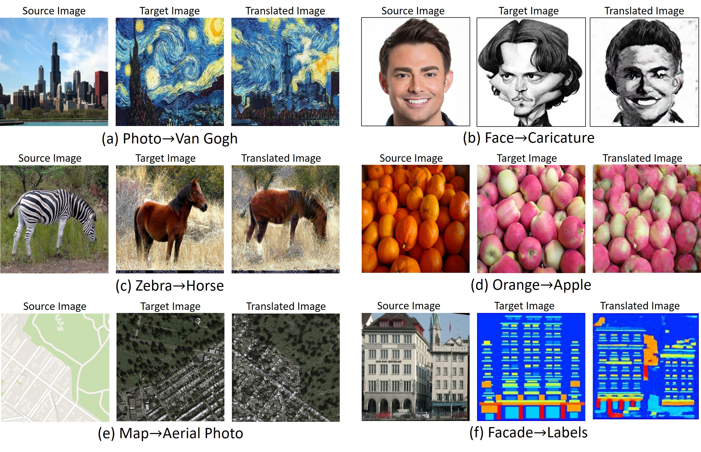
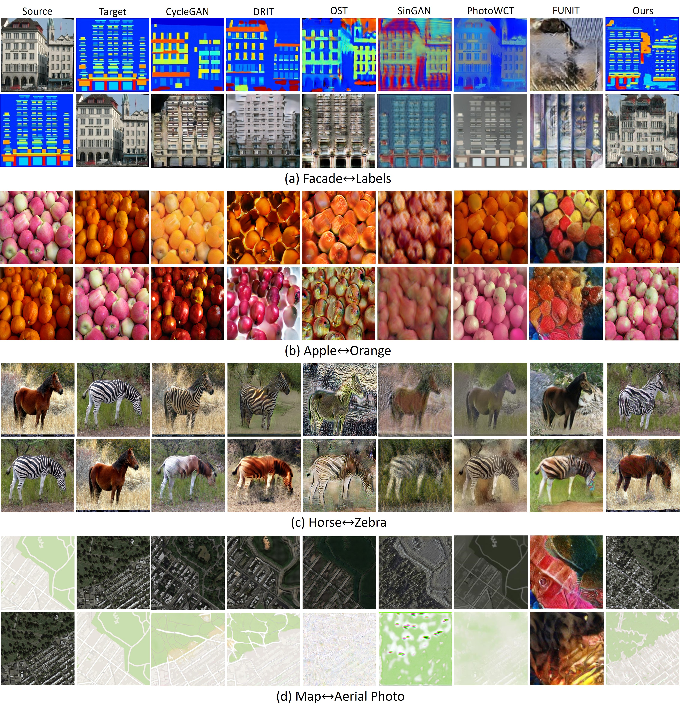
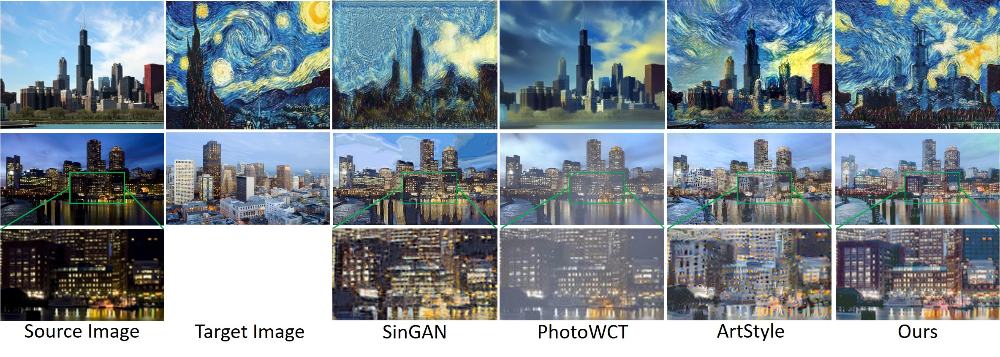
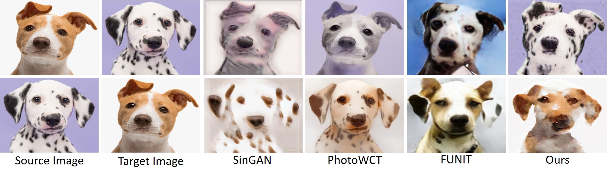
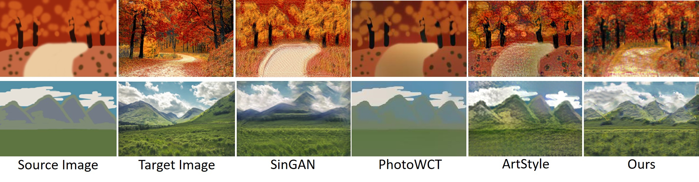
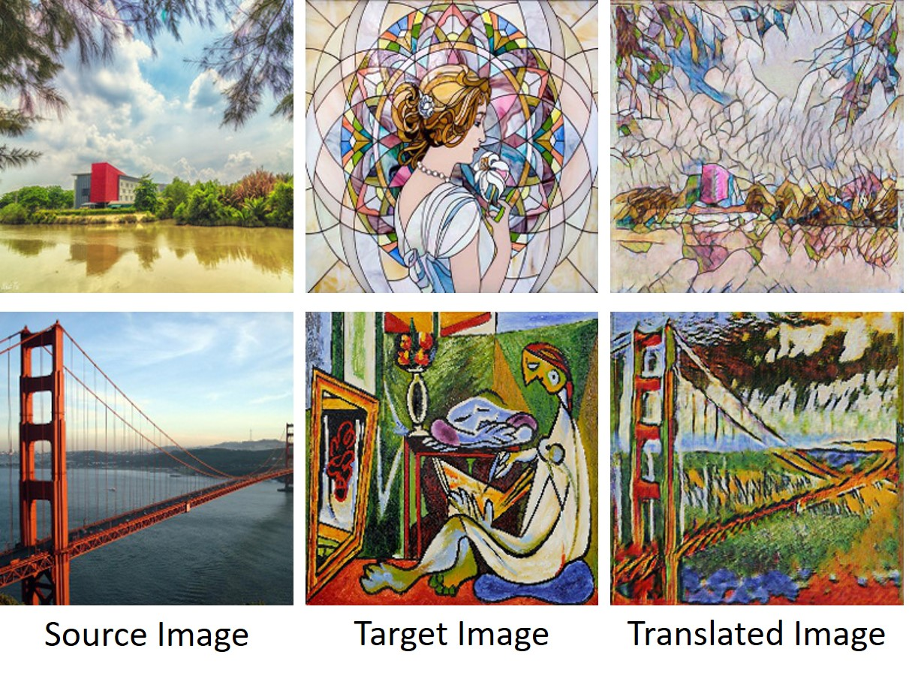
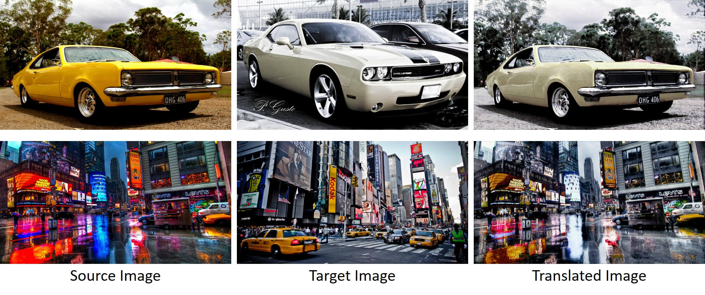
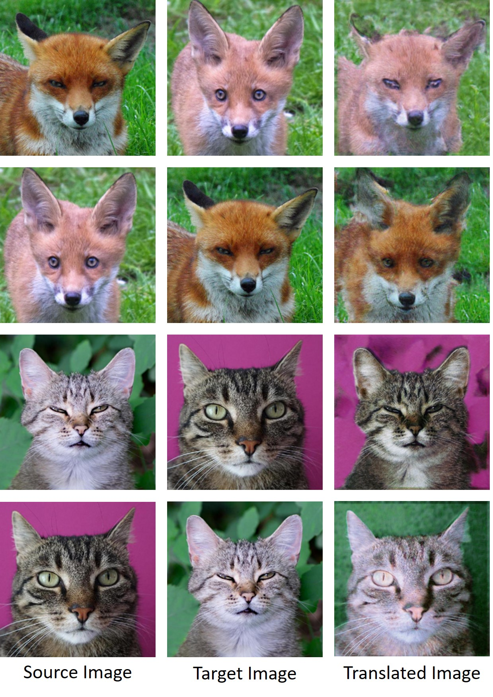

# TuiGAN-PyTorch
Official PyTorch Implementation of "[TuiGAN: Learning Versatile Image-to-Image Translation with Two Unpaired Images](https://arxiv.org/abs/2004.04634)" (ECCV 2020 Spotlight)

## TuiGAN's applications
TuiGAN can be use for various computer vision tasks ranging from image style transfer to object transformation and appearance transformation:
 

## Usage

### Install dependencies

```
python -m pip install -r requirements.txt
```

Our code was tested with python 3.6  and PyToch 1.0.0 or 1.2.0

###  Train
To train TuiGAN model on two unpaired images, put the first training image under `datas/task_name/trainA` and the second training image under `datas/task_name/trainB`, and run

```
python train.py --input_name <input_name> --root <datas/task_name>
```
For example, 
```
python train.py --input_name apple --root datas/apple
```
##  Comparison Results

###  General Unsupervised Image-to-Image Translation

###  Image Style Transfer

###  Animal Face Translation

###  Painting-to-Image Translation


##  More Results

###  Art Style Transfer 


###  Photorealistic Style Transfer 


###  Animal Face Translation


